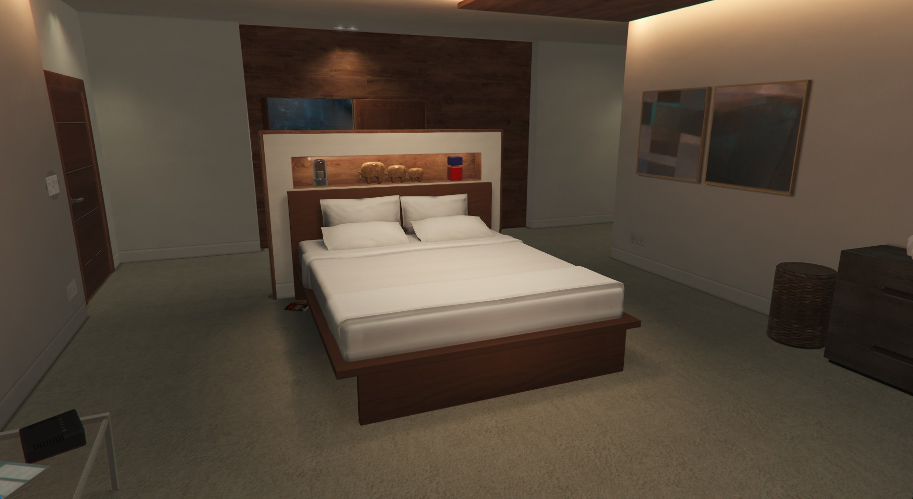

<h1> Property Management</h1>

Los Santos genelinde satın alınabilir veya kiralanabilir mülkler için kullanılabilir iç mekan seçenekler ve galeride satışı olmayan araçlar bu katalog altında listelenmektedir.

Property Management Departmanı tarafından yönetilen bu sistem, oyuncuların karakter hikâyelerine ve kullanım amaçlarına uygun mülkleri seçebilmelerini amaçlamaktadır. Tüm rezidanslar, garajlar, ofisler, depolar ve işletmeler aşağıda kategorilere ayrılmış şekilde sunulmuştur.

Mülk ve araç başvurularında tercih edilen iç mekanın adı veya kodunun belirtilmesi zorunludur. Eksik veya hatalı interior bildirimleri başvuru sürecinin uzamasına neden olabilir.

<table>
<tr>
<td>

### 📌 Başvuru Bilgileri

**Mülk/Araç Başvuruları:** 🟢 AÇIK

<strong>Başvuru Merkezi:</strong><a href="https://ucp.fast-rp.com/ls/applications/property" target="_blank">
Property Management Başvuruları
</a>

<strong>🏠 Rezidans İç Mekanları</strong>

 

- **Modern Apartment 1**
- **Mody 1 Apartment**
- **Vibrant 1**
- **Sharp 1**
- **Monochrome**
- **Seduttive**
- **Aqua**
- **Integrity Way Apt**
- **Del Perro Heights Apt 1**
- **Del Perro Heights Apt 2**

<strong>🚗 Sivil Garajlar</strong>

 

- **2 Car Garage:** 2 araç kapasitesi, temel garaj çözümleri.
- **6 Car Garage:** 6 araç kapasitesi, orta ölçekli kullanım.
- **10 Car Garage:** 10 araç kapasitesi, koleksiyon ve işletme amaçlı kullanım.
- **Warehouse Garage:** Devasa araç kapasitesi, depolama amaçlı endüstriyel tasarım.

<strong>🏢 Meslek Ofisleri</strong>

 

- **Executive Rich:** Yönetici ofisi, lüks tasarım.
- **Executive Cool** Modern, ferah tasarım.
- **Executive Contrast:** Kurumsal tasarım. 
- **Solomon Office:** Genel kullanım, medya ve işletme konseptleri.
- **Psychiatrist's Office:** Psikolog / Psikiyatrist konsepti

<strong>📦 Çok Amaçlı Depolar</strong>

 

- **Warehouse 1**
- **Warehouse 2**
- **Warehouse 3**
- **Warehouse 4**
- **Warehouse 5**
- **Warehouse Small**
- **Warehouse Medium**
- **Warehouse Large**

<strong>🏬 Belirli Konseptlere Uygun İşletmeler</strong>

 

- **Jewel Store**
- **Nightclub**

</td>
</tr>
</table>

## 📖 İç Mekan Kataloğu Hakkında

Bu katalogda yer alan tüm interiorlar aktif kullanım havuzunda bulunan seçeneklerden oluşmaktadır. Property Management Departmanı, sunucunun gelişimi doğrultusunda interior havuzunu düzenli olarak günceller ve yeni seçenekleri kullanıma sunar.

Yeni interiorlar, özel mülk seçenekleri ve farklı kullanım alanları ilerleyen güncellemelerle birlikte kataloğa eklenmeye devam edecektir.

Başvuru sahiplerinin tercih ettikleri interiorları incelemeleri ve taleplerini buna göre oluşturmaları tavsiye edilir.

---

## 📋 Başvuru Süreci

1. Katalogdan uygun interiorı belirleyin.
2. İlgili iç mekan adını veya kodunu not alın.
3. Property Management başvuru merkezine gidin.
4. Başvurunuzu eksiksiz şekilde oluşturun.
5. Değerlendirme sonucunu bekleyin.

---

## ⚖️ Değerlendirme Politikası

Property Management Departmanı, mülk dağıtım süreçlerinde adil, düzenli ve sürdürülebilir bir yönetim anlayışı benimsemektedir.

Tüm başvurular değerlendirme sırasına göre incelenir ve uygun görülen talepler ilgili prosedürler doğrultusunda sonuçlandırılır. Başvurunun gönderilmiş olması tek başına onay garantisi sağlamaz.

---
> Katalogda yer alan interiorlar zaman içerisinde Property Management Ekibi tarafından güncellenebilir, değiştirilebilir veya kullanım dışına alınabilir.

> Bir iç mekan tarafınıza tahsis edildiyse ve kullanım dışına alınacaksa; tarafınıza, önlem almanız adına bir hafta öncesinden haber verilir.